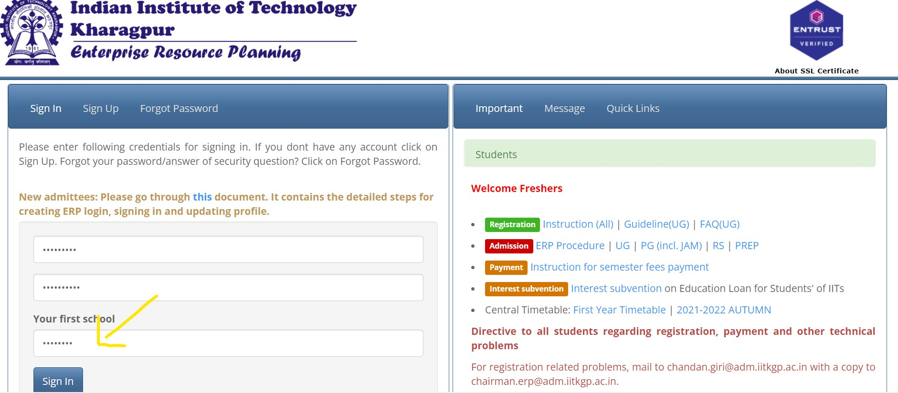

# ERP_auto_login
If pip isn't installed in your system [click here](https://www.geeksforgeeks.org/how-to-install-pip-on-windows/)

```python
pip install selenium
```
### step to follow:
STEP 1: Go to login_Data.py file and open in any IDE
STEP 2: Follow the instructions given there inside.

NOTE: The questions are the ones that come as security questions like "Name your favorite actor", "Name your first School" etc. Mention the questions exactly as they are(word to word) and their corresponding answers.


